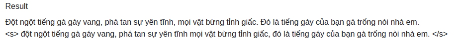
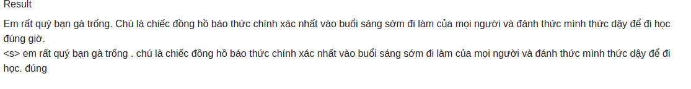
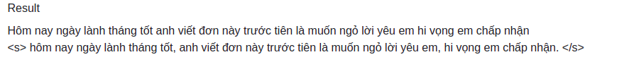

## Punctuation Restoration for Vietnamese

Our Implementation of seq2punct. Our problem is restoring missing puncts of  Vietnamese sentences.
We consider this problem with [just comma and period]. 


## Result







## Dataset
Input: Seq of words

Output: Seq of punct

Ex: Text "Một đêm nọ tôi nằm mơ thấy em "  has the label: " 0  1  0  0  0  0  0  2" with [0, 1, 2] denotes space, comma, period respectively. 

You can download from  ...

## Using 
* Clone this repo
* Pip install requirements
* Create dumps/ folder for saving model checkpoint

## Train

We followed seq2seq architecture. The test accuracy is ~85-90%.  

To train
```
python main.py --model [RNN] --n_layers [2] -- embedding_size [256] --hidden_dim [256]

```

## Inference 


To infere

```
from infere import pipeline

text = 'Tôi là Khang tôi là sinh viên trường Bách Khoa'

res = pipeline(text)

```


## Using bert 
We use pretrained phobert to extract the features of text, then add RNN and MLP to classify punct. The result ~ 95% accuracy


Train with training_bert.ipynb
Infere with infere_bert.py


## Demo with flask
```
python app.py
```

